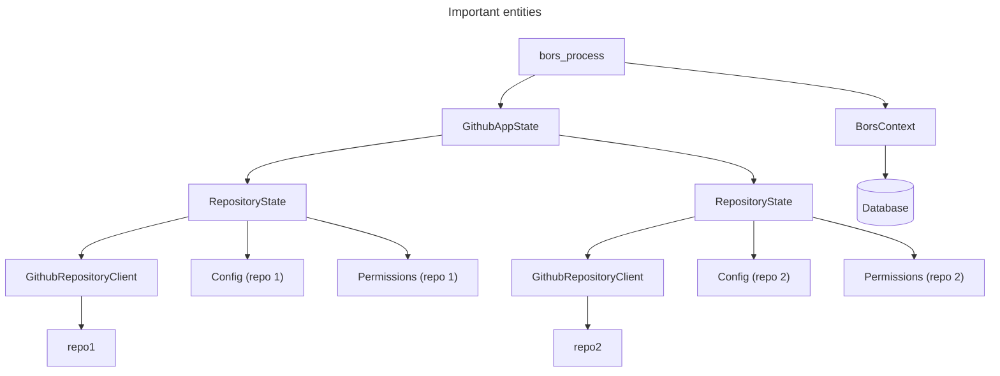

# Development guide
This document should help you make sense of the codebase and provide
guidance on working with it and testing it locally.

Directory structure:
- `database/migration`
    - `SeaORM` migrations that are the source of truth for database schema
- `database/entity`
    - Automatically generated `SeaORM` DB entities, which are generated from a (Postgre) database.
- `src/bors`
    - Bors commands and their handlers.
- `src/database`
    - Database ORM layer built on top of SeaORM.
- `src/github`
    - Communication with the GitHub API and definitions of GitHub webhook messages.

## Architecture diagram
The following diagram shows a simplified view on the important state entities of Bors. `bors_process` handles events generated by webhooks. It uses a shared global state through `BorsContext`, which holds a shared connection to the database and a command parser. It also has access to `GithubAppState`, which has a map of repository state. Each repository state contains an API client for that repository, its loaded config, and permissions loaded from the Team API.



## How to test bors on live repositories
Bors has a `cargo` test suite that you can run locally, but sometimes nothing beats an actual test on live, GitHub
repositories. Sadly, the process is currently quite involved, but it can still be done if needed.

> Note: we will eventually configure bors to have a staging environment e.g. at
> https://github.com/rust-lang/bors-kindergarten, however this is not configured yet.

One-time setup:
- Create your own GitHub app.
  - Configure its webhook secret.
  - Configure its private key.
  - Give it permissions for `Actions` (r/w), `Checks` (r), `Commit statuses` (r), `Contents` (r/w), `Issues` (r/w) and
  `Pull requests` (r/w).
  - Subscribe it to webhook events `Check suite`, `Check run`, `Issue comment`, `Issues`, `Pull request`,
    `Pull request review` and `Pull request review comment`.
- Install your GitHub app on some test repository where you want to test bors.
  - Don't forget to configure `rust-bors.toml` in the root of the repository, and also some CI checks.

Everytime you want to run bors:
- Run bors locally.
  - Set `APP_ID` to the ID of the app
  - Set `WEBHOOK_SECRET` to the webhook secret of the app.
  - Set `PRIVATE_KEY` to the private key of the app.
- Set up some globally reachable URL/IP address for your computer, e.g. using [ngrok](https://ngrok.com/).
  - Configure the webhook URL for your app to point to `<address>/github`.
- Try `@bors ping` on some PR on the test repository :)

## Database
You must have `sea-orm-cli` installed for the following commands to work.
```console
$ cargo install sea-orm-cli
```

You must also set up a `DATABASE_URL` environment variable. **You can use SQLite for local testing,
but when entities are regenerated, it should be done against a Postgre database!**
```console
$ export DATABASE_URL=sqlite://bors.db?mode=rwc
```

### Updating the DB schema
1) Generate a new migration
    ```console
    $ sea-orm-cli migrate -d database/migration/ generate <name>
    ```
2) Change the migration manually in `database/migration/src/<new-migration>.rs`.
3) Apply migrations to a **Postgre** DB. (You can use Docker for that).
    ```console
    $ sea-orm-cli migrate -d database/migration/ up
    ```
4) Re-generate entities, again against a **Postgre** DB.
    ```console
    $ sea-orm-cli generate entity -o database/entity/src --lib
    ```
